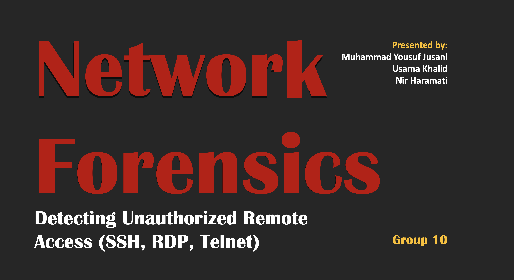

# 🔐 Network Forensic Project  
### Detecting Unauthorized Remote Access (SSH, RDP, Telnet)



---

## 📌 Overview
This project focuses on detecting **unauthorized remote access attempts** using network forensic techniques.  
It captures and analyzes network traffic to identify suspicious activities such as **brute-force login attempts**.

---

## 🎯 Objectives
- Detect unauthorized access using **SSH, RDP, and Telnet**
- Analyze captured network traffic
- Identify **suspicious patterns and repeated login attempts**
- Generate a **forensic security report**

---

## ⚙️ Tech Stack
- 🦈 Wireshark – Packet capture  
- 🐍 Python (PyShark) – Packet analysis  
- 📁 PCAP Files – Captured data  
- 🛡️ Snort (optional) – Intrusion Detection  

---

## 🧠 System Workflow

```
Network Traffic → Capture (Wireshark) → Filter → Analyze (Python) → Detect → Report
```

---

## 🧪 Implementation
1. Captured live network traffic using Wireshark  
2. Saved traffic as `.pcap` file  
3. Analyzed packets using Python (PyShark)  
4. Extracted source IP addresses  
5. Counted repeated connection attempts  
6. Flagged suspicious activity  

---

## 🚀 How to Run

### 1. Install Dependencies
```bash
pip3 install pyshark
```

### 2. Navigate to Project Folder
```bash
cd NetworkForensic-Project/code
```

### 3. Run Script
```bash
python3 detect.py
```

## 📊 Sample Output
```
--- Analysis Result ---

192.168.2.20 → 12 attempts
104.18.32.47 → 20 attempts
⚠️ Possible brute-force attack from 104.18.32.47
```

---

## ⚠️ Error Handling
- Handles packets without IP or TCP layers
- Prevents runtime errors using conditional checks
- Ensures stable packet processing
  
---

## 🔍 Key Features
- Detects suspicious repeated connections
- Lightweight and efficient analysis
- Works with real-time or saved network traffic
- Easy to extend for IDS integration

---

## 📁 Project Structure

```
NetworkForensic-Project/
│── code/
│   ├── detect.py
│   ├── remote_access.pcap
│
│── cover.png
│── NF_PresentationGroup10.pptx (Presentation Slides)
│── Team10-ReportDocumentation.pdf (Final Report)
│
│── README.md
```

---

## 📚 References
- https://www.wireshark.org
- https://github.com/KimiNewt/pyshark
- https://www.snort.org

---

## 👨‍💻 Contributors
- **Muhammad Yousuf Jusani (04649338)**
- **Usama Khalid (0443145)**
- **Nir Haramati (0474218)**

---

## 📌 Note
This project is developed for **educational purposes in Network Forensics**. It demonstrates how captured network traffic can be analyzed to detect unauthorized remote access attempts and improve system security.
